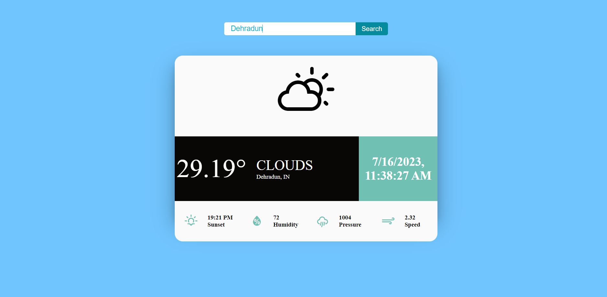

# Weather Glimpse



Welcome to Weather Glimpse, a web app that provides live weather data to help you stay updated on the current weather conditions.

## Features

- Real-time weather data from OpenWeatherMap API.
- Intuitive and user-friendly interface.
- Displays temperature, humidity, pressure, and weather conditions.
- Search functionality to find weather information for different locations.

## Demo

Check out the live demo of Weather Glimpse [here](https://weather-glimpse.netlify.app).

## Installation

To run Weather Glimpse locally, follow these steps:

1. Clone the repository: `https://github.com/MrM-7/Weather-Glimpse.git`
2. Install the dependencies:

```
cd weather-glimpse
npm install
```

3. Create a `.env` file in the root directory and add the following line:

```
REACT_APP_API_KEY=your_openweathermap_api_key
```

4. Start the development server:

```
npm start
```

5. Open your browser and navigate to `http://localhost:3000` to access Weather Glimpse.

## Technologies Used

- React
- HTML
- CSS
- JavaScript

## API Reference

Weather Glimpse utilizes the [OpenWeatherMap API](https://openweathermap.org/api) to fetch live weather data.

## License

This project is licensed under the [MIT License](LICENSE).
